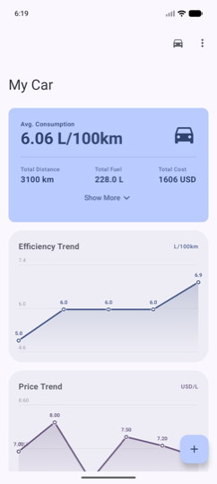
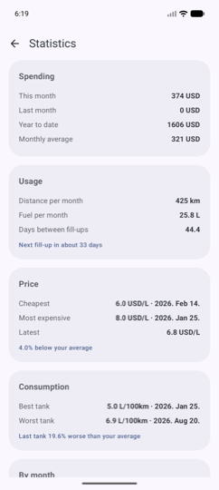
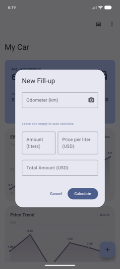
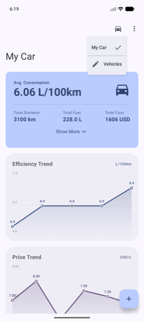

# FuelApp

Android app for tracking fuel consumption across one or more vehicles. Log
every refuel, get real L/100km numbers, running costs and a range estimate —
offline, on device, no account.

## Screenshots

| Dashboard | Statistics | New fill-up | Vehicles |
|---|---|---|---|
|  |  |  |  |

## Features

- **Multiple vehicles** — keep a separate log per car, switch from the top bar.
  Statistics, charts and the widget all follow the selected vehicle.
- **Configurable currency** — set any code or symbol in Settings; it defaults to
  the device locale's currency.
- **Fuel log** — date, odometer, liters, price per liter; total cost is
  calculated as you type, and any two of the three amount fields fill in the third.
- **Partial refuels** — entries can be marked as not-a-full-tank. Consumption is
  measured tank-to-tank between full fills, so partials are accounted for without
  skewing the average.
- **Statistics** — the dashboard shows average consumption, totals, cost per km
  and, when the vehicle has a tank size, a predicted range. A separate Statistics
  screen adds spending this month, last month and year to date; distance and fuel
  per month; how often you fill up and roughly when the next one is due; your
  cheapest, dearest and latest price with dates; your best and worst tank; whether
  the last tank was better or worse than your average; and a month-by-month
  breakdown.
- **Charts** — price-per-liter trend and efficiency trend over time, drawn natively.
- **Odometer scanning** — point the camera at the odometer and the reading is
  recognised on device via ML Kit; no image leaves the phone.
- **CSV import / export** — share every vehicle's log out as CSV and read it back
  in; rows are matched to vehicles by name, and older exports still import.
- **Home screen widget** — current consumption at a glance, tap to add an entry.
- **Forgiving input** — decimal commas as well as points, undo when you delete a
  fill-up, and a reason whenever something is rejected or fails.
- **Localised** — English and Hungarian.

## Install

Grab the APK from the [latest release](https://github.com/Bokor-Attila/FuelApp/releases/latest)
and open it on your phone, allowing installation from unknown sources when prompted.
For update notifications, point [Obtainium](https://github.com/ImranR98/Obtainium) at this
repository.

## Requirements

| | |
|---|---|
| JDK | 21 |
| Android Studio | any version supporting AGP 9.2 |
| `minSdk` | 28 (Android 9) |
| `targetSdk` / `compileSdk` | 36 |

## Building

```bash
git clone https://github.com/Bokor-Attila/FuelApp.git
cd FuelApp
./gradlew assembleDebug
```

The APK lands in `app/build/outputs/apk/debug/`. Install it with:

```bash
adb install -r app/build/outputs/apk/debug/app-debug.apk
```

Android Studio users can just open the project folder — the SDK path is written
to `local.properties` on first sync and is not tracked.

## Tests and checks

```bash
./gradlew testDebugUnitTest   # unit tests
./gradlew lintDebug           # Android lint
./gradlew assembleDebug       # build
```

Everything in `domain/` and `data/CsvIo.kt` is pure functions over the entry
list, so it is covered by JVM unit tests without an emulator: `FuelStatsTest`
for the tank-to-tank rules, `StatisticsTest` for spending, usage, price and
trend, `CsvTest` for the import/export round trip, plus parsing tests for
decimal commas and odometer readings.

Database migrations and DAO behaviour are covered by instrumented tests, which need
a connected device or a running emulator:

```bash
./gradlew connectedDebugAndroidTest
```

Room schemas are exported to `app/schemas/` and committed, so schema changes show up
in review.

## Continuous integration

`.github/workflows/android.yml` runs unit tests, lint and a debug build on every
push to `main`, every `feature/**` branch and every pull request. Tagging a commit
`v*` builds a signed, R8-minified release APK and publishes it to a GitHub release.

## Architecture

Single-module app, Kotlin and Jetpack Compose throughout, split into three layers.

```
com.bokor.fuelapp
├── MainActivity.kt            Activity, hosts the dashboard
├── FuelViewModel.kt           Selected vehicle, entries and settings as StateFlows
├── FuelWidgetProvider.kt      Home screen widget
├── OdometerScanner.kt         CameraX preview and ML Kit text recognition
├── data/
│   ├── FuelData.kt            Room entities, DAOs, database and migrations
│   ├── SettingsRepository.kt  Currency and selected vehicle, in DataStore
│   └── CsvIo.kt               CSV building, parsing, import and export
├── domain/
│   ├── FuelStats.kt           Dashboard figures, tank-to-tank consumption
│   ├── Statistics.kt          Spending, usage, price and trend analysis
│   └── AmountParsing.kt       Comma- and point-tolerant number parsing
└── ui/
    ├── FuelDashboard.kt       Main screen
    ├── StatisticsScreen.kt    Statistics screen
    ├── StatsCard.kt           Headline consumption card
    ├── FuelEntryItem.kt       A row in the log
    ├── AddFuelEntryDialog.kt  Add and edit a fill-up
    ├── VehicleDialogs.kt      Vehicle management and settings
    ├── charts/                Price and efficiency charts
    └── theme/                 Material 3 theme
```

The `domain` layer holds no Android types, so every calculation the app shows is
covered by plain JVM unit tests. Data lives in a local Room database
(`fuel_database`) and nothing is transmitted anywhere.

## Roadmap

- Imperial units (miles and mpg) alongside kilometres and L/100km
- Per-vehicle currency
- A repository layer and dependency injection in place of the manual factory
- Running the instrumented tests in CI

## License

Copyright 2026 Attila Bokor

Licensed under the [Apache License, Version 2.0](LICENSE). You may not use this
work except in compliance with the License.

Apache-2.0 is deliberate rather than copyleft: the app links Google's ML Kit for
on-device text recognition, which is a proprietary binary, and a GPL licence
would be inconsistent with that.
